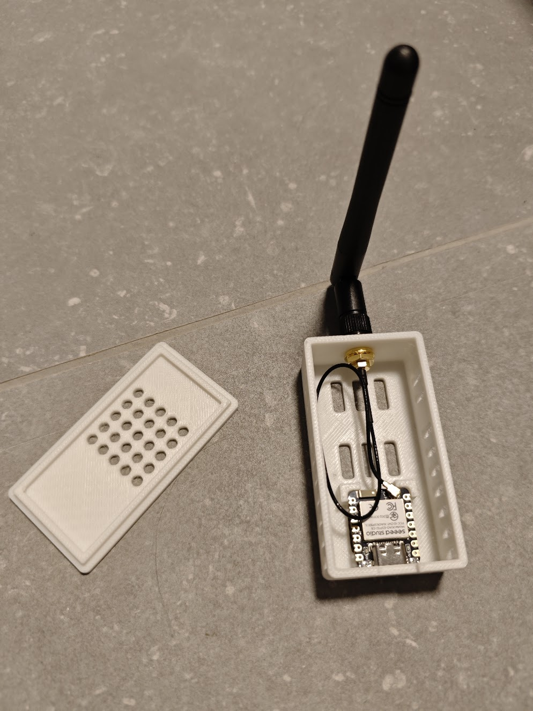

<div align="center">

# 📡 ESP32-C6 Zigbee Router

**Extend Your Zigbee Network Coverage with an Affordable ESP32-C6!**



[](https://esphome.io/)
[](https://zigbeealliance.org/)
[](https://www.home-assistant.io/)

This ESPHome configuration turns an ESP32-C6 board into a Zigbee router that seamlessly integrates with your Zigbee network to expand coverage and improve connectivity for your Zigbee devices.

---

</div>

## 📋 Prerequisites

| Requirement | Description |
|-------------|-------------|
| **🔧 Hardware** | ESP32-C6 board (tested with [Seeed Studio XIAO ESP32C6](https://www.seeedstudio.com/Seeed-Studio-XIAO-ESP32C6-p-5884.html)) |
| **🌐 Network** | Zigbee Coordinator in your network (e.g., Home Assistant with Zigbee2MQTT or ZHA) |
| **💻 Software** | ESPHome installed |
| **🔌 Cable** | USB cable for initial flashing |
| **📦 Optional** | 3D-printed case - [XIAO ESP32-C6 Case](https://www.printables.com/model/1543275-xiao-esp32-c6-zigbee-router-case-split-lid-sma-ext) |

---

## 🔑 Required Information

### 📡 Zigbee Router - How does it work?

A Zigbee router is a **mains-powered device** that:
- ✅ Relays Zigbee signals between devices (mesh network)
- ✅ Extends the range of your Zigbee network
- ✅ Improves stability and reliability
- ✅ Connects battery-powered devices (End Devices) to the Coordinator

## 🚀 Installation

### 📝 Step 1: Configure Settings (Optional)

The default configuration works right away! You can optionally customize:

**`esp32-c6-zigbee-router.yaml`:**
```yaml
substitutions:
  device_name: esp32-c6-zigbee-router  # Unique name
  friendly_name: ESP32-C6 Zigbee Router  # Display name
```

**Enable WiFi (optional):**
```yaml
# Uncomment lines in the YAML file:
wifi:
  ssid: !secret wifi_ssid
  password: !secret wifi_password

api:
  encryption:
    key: !secret api_encryption_key

ota:
  - platform: esphome
```

### ⚡ Step 2: Compile and Flash Firmware

Connect your ESP32-C6 via USB and flash the firmware using local ESPHome:

```bash
esphome run esp32-c6-zigbee-router.yaml --device=/dev/ttyACM0
```

> **💡 Note:** Replace `/dev/ttyACM0` with your device path (see troubleshooting below)

<details>
<summary><b>📚 Important Notes & Troubleshooting</b></summary>

### 📍 Device Paths by OS

| OS | Typical Paths |
|----|--------------|
| 🐧 Linux | `/dev/ttyUSB0`, `/dev/ttyACM0`, `/dev/ttyUSB1` |
| 🍎 macOS | `/dev/cu.usbserial-*`, `/dev/cu.wchusbserial*` |
| 🪟 Windows | `COM3`, `COM4`, etc. |

**Check available ports:**
- Linux/macOS: `ls /dev/tty*`
- Windows: Device Manager

---

### 🔐 USB Permission Issues

**Standard Linux - Add user to dialout group:**
```bash
sudo usermod -a -G dialout $USER
# Then log out and back in
```

**Fedora Atomic/Bazzite with rootless Docker/Podman:**

The dialout group doesn't work reliably on immutable systems. You need to fix permissions before each flash:

```bash
# Check permissions
ls -la /dev/ttyACM0
# Output: crw-rw----. 1 root dialout 166, 0 ...

# Fix temporarily (resets on USB reconnect)
sudo chmod 666 /dev/ttyACM0
```

> ⚠️ **Note:** You need to run `sudo chmod 666` each time you reconnect the USB device.

</details>

---

<details>
<summary><b>🐳 Alternative: Using Docker/Podman</b></summary>

> ⚠️ **Important:** When using Docker/Podman (rootless), you need to fix USB permissions before flashing.

```bash
# 1. Start container
docker-compose up -d

# 2. Flash the firmware
docker-compose exec esphome esphome run /config/zigbee/esp32-c6-zigbee-router.yaml --device=/dev/ttyACM0
```

> **📌 Note:** The docker-compose.yml mounts the parent `config/` directory to `/config` in the container. That's why you need `/config/zigbee/` in the path above. This is necessary so ESPHome can find the build files in `.esphome/`.

</details>

---

<details>
<summary><b>🌐 Alternative: Web Dashboard (GUI)</b></summary>

Choose between local or hosted dashboard:

**Docker Dashboard:**
```bash
# Start container if not already running
docker-compose up -d

# Start the dashboard
docker-compose exec esphome esphome dashboard /config
```
Then open **http://localhost:6052** in your browser and navigate to the zigbee folder.

**Local Dashboard** (requires local ESPHome):
```bash
esphome dashboard .
```
Then open **http://localhost:6052** in your browser and use the web interface.

**Hosted Dashboard** (no installation needed):
> **🎉 No installation needed!** Flash directly from your browser.

1. Visit **https://web.esphome.io/**
2. Click "Connect" and select your ESP32-C6 device
3. Upload your `esp32-c6-zigbee-router.yaml` configuration file
4. Click "Install" to compile and flash

**Perfect for:** Users who prefer GUI over command line, or quick flashing without local ESPHome installation.

</details>

---

### 🔗 Step 3: Connect Router to Coordinator

After flashing is complete, enable pairing mode on your Zigbee Coordinator:

**Zigbee2MQTT:**
1. Open the Zigbee2MQTT Web UI
2. Click **"Permit join (All)"** button (top right)
3. Pairing mode stays active for 4-5 minutes
4. The ESP32-C6 will automatically appear in the device list

**ZHA (Home Assistant):**
1. Go to **Settings → Devices & Services → ZHA**
2. Click **"Add Device"**
3. Select **"Add Zigbee device"**
4. The ESP32-C6 will be discovered and added

> **⏱️ Note:** The device will search for and join the network automatically within 30-60 seconds after boot. Keep pairing mode active until the device appears!

---

## ✅ Verification & Testing

### 🔍 Check if Zigbee Router is working:

#### 📋 Method 1: View Logs

**Logging Options:**

**🔌 Option A: Serial Connection (USB)**
- Always available - Connect via USB cable

**📡 Option B: Over WiFi (OTA)**
- Only works when WiFi is enabled

```bash
esphome logs esp32-c6-zigbee-router.yaml
```

You should see:
- No continuous error messages
- `[zigbee:xxx] Device Type: Router`
- Successful connection to Zigbee network

---

#### 🌐 Method 2: Check Zigbee Network

**Zigbee2MQTT:**
- Open the Zigbee2MQTT Web UI
- Go to "Map"
- The ESP32-C6 should be visible as a router
- Check the Link Quality to other devices

**ZHA (Home Assistant):**
- Go to **Settings → Devices & Services → ZHA**
- Click "Visualize"
- The ESP32-C6 should be displayed as a router

---

#### 🏠 Method 3: Home Assistant Integration (only with WiFi)

- Go to **Settings → Devices & Services**
- The ESP32-C6 should appear as a discovered device
- Add it to Home Assistant (use `esp32-c6-zigbee-router.local` or IP address)
- Check device status - should show "Online"

---

## 🔄 Multiple Zigbee Routers

To flash multiple ESP32-C6 devices and use them as separate routers in the same Zigbee network:

### 1. Create Device-Specific Configuration Files

For each additional device, create a new YAML file (e.g., `esp32-c6-zigbee-router-2.yaml`):

### 2. Flash Additional Devices

Each device will join the same Zigbee network and act as an independent router, extending your mesh coverage.

```bash
esphome run esp32-c6-zigbee-router-2.yaml --device=/dev/ttyACM0
```

---

## 📂 File Structure

```
.
├── esp32-c6-zigbee-router.yaml     # Main ESPHome configuration
├── esp32-c6-zigbee-router-2.yaml   # Optional: Second router
├── esp32-c6-zigbee-router-3.yaml   # Optional: Third router
├── partitions_zb.csv               # Custom Partition Table for Zigbee
├── secrets.yaml                    # Shared credentials (not in git)
├── .gitignore                      # Excludes secrets and build artifacts
├── docker-compose.yml              # Docker/Podman setup for ESPHome
└── README.md                       # This file
```

---

## 📚 Further Resources

| Resource | Description |
|----------|-------------|
| 📖 [ESPHome Zigbee Component](https://github.com/luar123/zigbee_esphome) | External Zigbee component for ESPHome |
| 🔗 [Zigbee Alliance](https://zigbeealliance.org/) | Learn the basics of Zigbee networking |
| 🏠 [Home Assistant Zigbee Integration](https://www.home-assistant.io/integrations/zha/) | How Zigbee works in Home Assistant |
| 📡 [Zigbee2MQTT](https://www.zigbee2mqtt.io/) | Alternative Zigbee bridge |

---

<div align="center">

**Made by the open source community**

⭐ Star us on [GitHub](https://github.com/firsttris/esp32c6-zigbee-router) • 🐛 [Report a Bug](https://github.com/firsttris/esp32c6-zigbee-router/issues) • 💡 [Request a Feature](https://github.com/firsttris/esp32c6-zigbee-router/issues)

</div>
